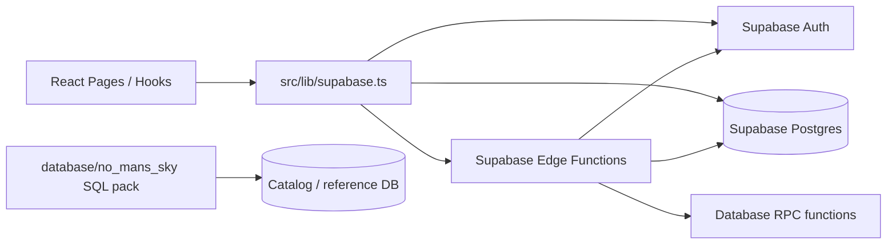
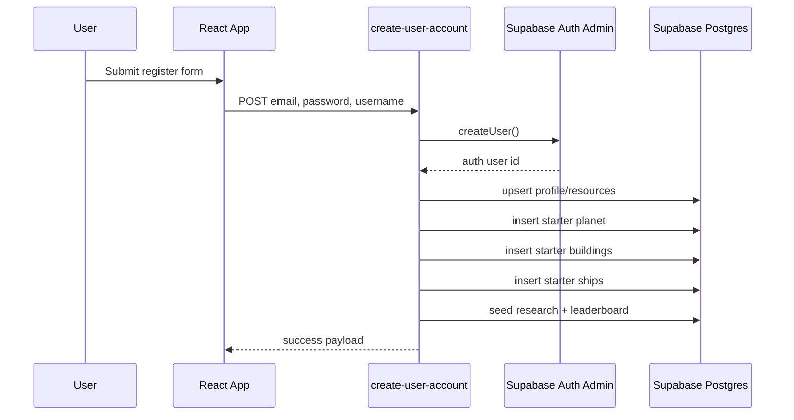
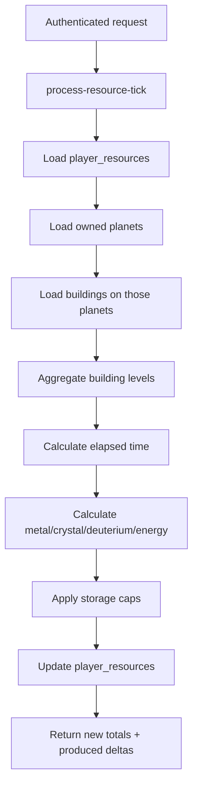
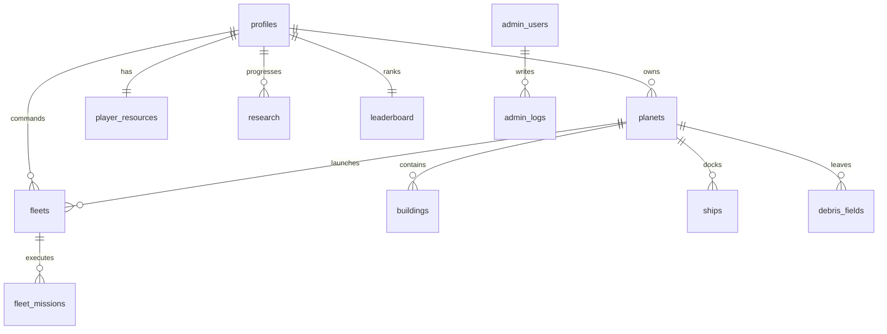

# Backend UML

## 1. Backend Component View

```mermaid
flowchart LR
  UI[React Pages / Hooks] --> Client[src/lib/supabase.ts]
  Client --> Auth[Supabase Auth]
  Client --> DB[(Supabase Postgres)]
  Client --> Edge[Supabase Edge Functions]

  Edge --> Auth
  Edge --> DB
  Edge --> RPC[Database RPC functions]

  SQL[database/no_mans_sky SQL pack] --> SQLite[(Catalog / reference DB)]
```

## 2. Account Creation Sequence

```mermaid
sequenceDiagram
  participant User
  participant App as React App
  participant Edge as create-user-account
  participant Auth as Supabase Auth Admin
  participant DB as Supabase Postgres

  User->>App: Submit register form
  App->>Edge: POST email, password, username
  Edge->>Auth: createUser()
  Auth-->>Edge: auth user id
  Edge->>DB: upsert profile/resources
  Edge->>DB: insert starter planet
  Edge->>DB: insert starter buildings
  Edge->>DB: insert starter ships
  Edge->>DB: seed research + leaderboard
  Edge-->>App: success payload
```

## 3. Resource Tick Flow

```mermaid
flowchart TD
  A[Authenticated request] --> B[process-resource-tick]
  B --> C[Load player_resources]
  C --> D[Load owned planets]
  D --> E[Load buildings on those planets]
  E --> F[Aggregate building levels]
  F --> G[Calculate elapsed time]
  G --> H[Calculate metal/crystal/deuterium/energy]
  H --> I[Apply storage caps]
  I --> J[Update player_resources]
  J --> K[Return new totals + produced deltas]
```

## 4. Core Gameplay Data Model

```mermaid
erDiagram
  profiles ||--o{ planets : owns
  profiles ||--|| player_resources : has
  profiles ||--o{ fleets : commands
  profiles ||--o{ research : progresses
  profiles ||--|| leaderboard : ranks

  planets ||--o{ buildings : contains
  planets ||--o{ ships : docks
  planets ||--o{ fleets : launches

  fleets ||--o{ fleet_missions : executes
  planets ||--o{ debris_fields : leaves

  admin_users ||--o{ admin_logs : writes
```
