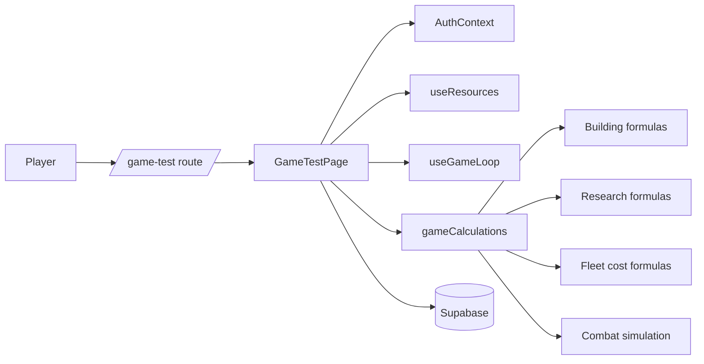
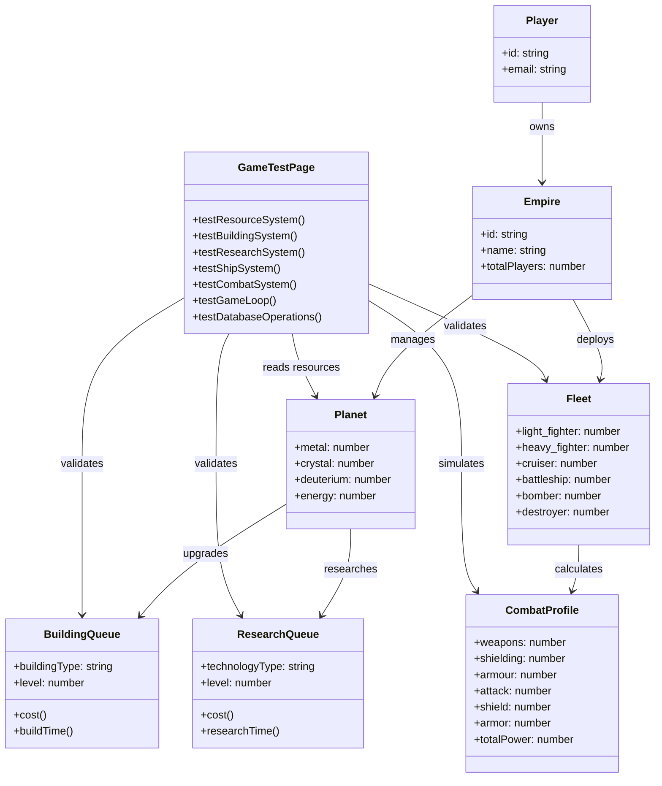
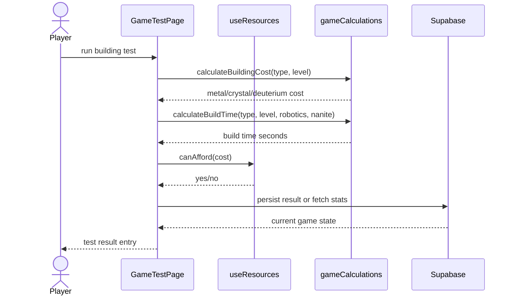
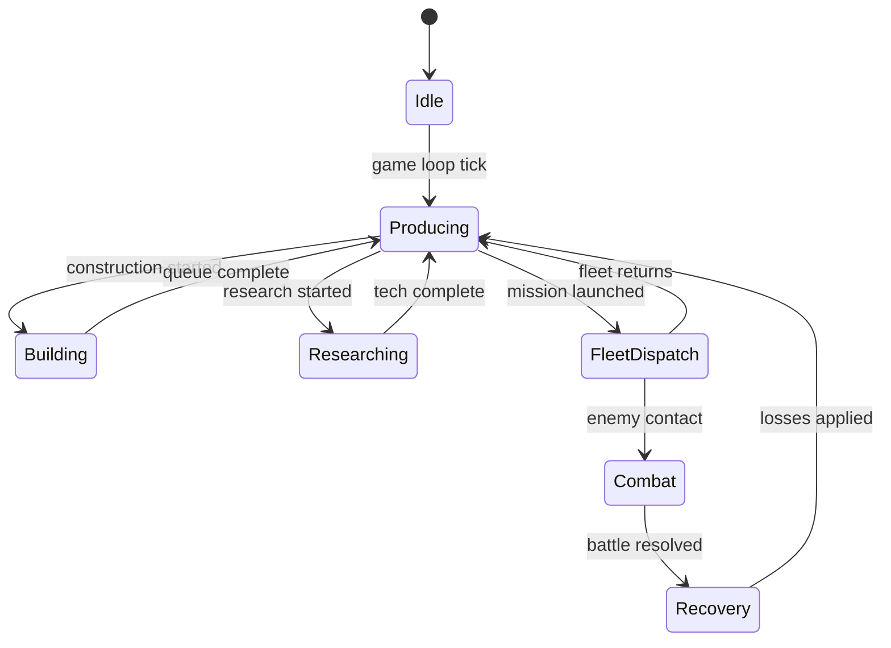

# OGame 0.84 UML

## System Context

```mermaid
flowchart LR
    Player[Player] --> Route[/game-test route/]
    Route --> Page[GameTestPage]
    Page --> Auth[AuthContext]
    Page --> Resources[useResources]
    Page --> Loop[useGameLoop]
    Page --> Calc[gameCalculations]
    Page --> DB[(Supabase)]
    Calc --> Buildings[Building formulas]
    Calc --> Research[Research formulas]
    Calc --> Fleet[Fleet cost formulas]
    Calc --> Combat[Combat simulation]
```

## Core Domain Class Diagram

```mermaid
classDiagram
    class Player {
      +id: string
      +email: string
    }

    class Empire {
      +id: string
      +name: string
      +totalPlayers: number
    }

    class Planet {
      +metal: number
      +crystal: number
      +deuterium: number
      +energy: number
    }

    class BuildingQueue {
      +buildingType: string
      +level: number
      +cost()
      +buildTime()
    }

    class ResearchQueue {
      +technologyType: string
      +level: number
      +cost()
      +researchTime()
    }

    class Fleet {
      +light_fighter: number
      +heavy_fighter: number
      +cruiser: number
      +battleship: number
      +bomber: number
      +destroyer: number
    }

    class CombatProfile {
      +weapons: number
      +shielding: number
      +armour: number
      +attack: number
      +shield: number
      +armor: number
      +totalPower: number
    }

    class GameTestPage {
      +testResourceSystem()
      +testBuildingSystem()
      +testResearchSystem()
      +testShipSystem()
      +testCombatSystem()
      +testGameLoop()
      +testDatabaseOperations()
    }

    Player --> Empire : owns
    Empire --> Planet : manages
    Planet --> BuildingQueue : upgrades
    Planet --> ResearchQueue : researches
    Empire --> Fleet : deploys
    Fleet --> CombatProfile : calculates
    GameTestPage --> Planet : reads resources
    GameTestPage --> BuildingQueue : validates
    GameTestPage --> ResearchQueue : validates
    GameTestPage --> Fleet : validates
    GameTestPage --> CombatProfile : simulates
```

## Resource Upgrade Sequence

```mermaid
sequenceDiagram
    actor Player
    participant Page as GameTestPage
    participant Resources as useResources
    participant Calc as gameCalculations
    participant DB as Supabase

    Player->>Page: run building test
    Page->>Calc: calculateBuildingCost(type, level)
    Calc-->>Page: metal/crystal/deuterium cost
    Page->>Calc: calculateBuildTime(type, level, robotics, nanite)
    Calc-->>Page: build time seconds
    Page->>Resources: canAfford(cost)
    Resources-->>Page: yes/no
    Page->>DB: persist result or fetch stats
    DB-->>Page: current game state
    Page-->>Player: test result entry
```

## Planet Runtime State

```mermaid
stateDiagram-v2
    [*] --> Idle
    Idle --> Producing : game loop tick
    Producing --> Building : construction started
    Producing --> Researching : research started
    Producing --> FleetDispatch : mission launched
    Building --> Producing : queue complete
    Researching --> Producing : tech complete
    FleetDispatch --> Combat : enemy contact
    FleetDispatch --> Producing : fleet returns
    Combat --> Recovery : battle resolved
    Recovery --> Producing : losses applied
```
